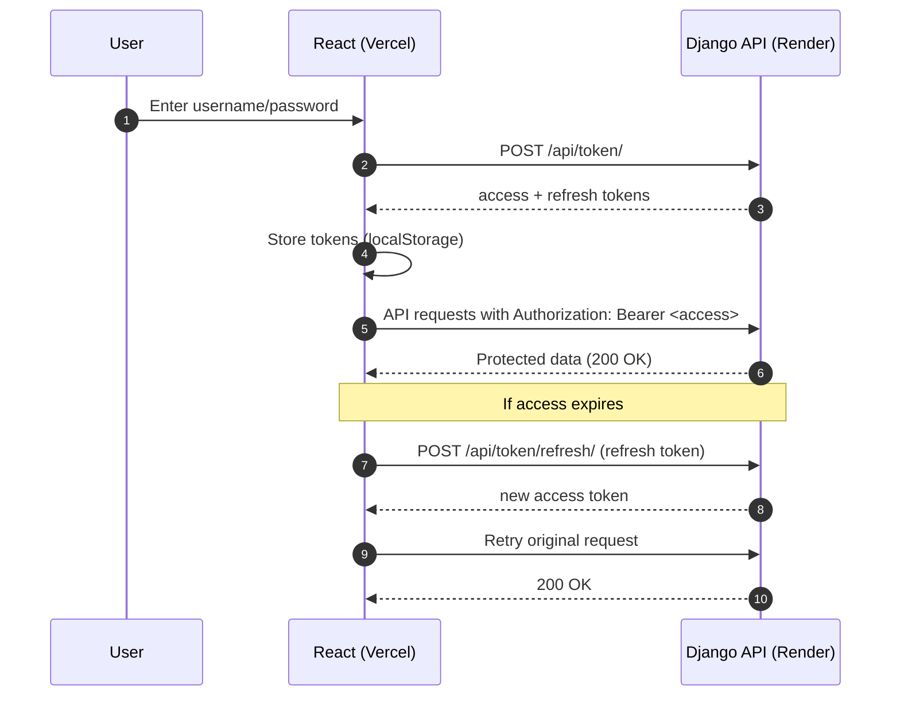
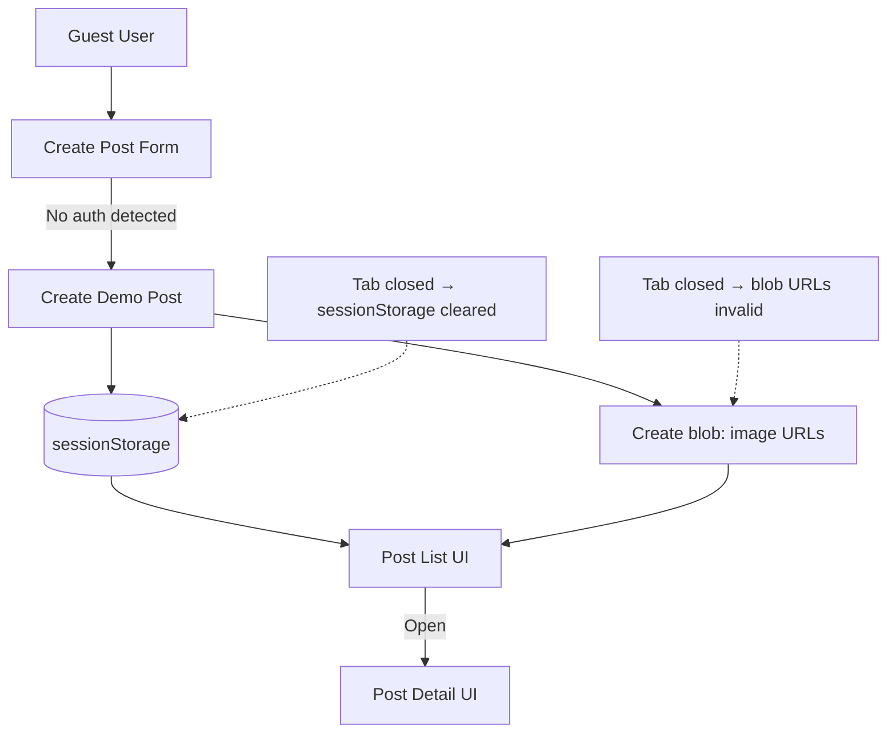
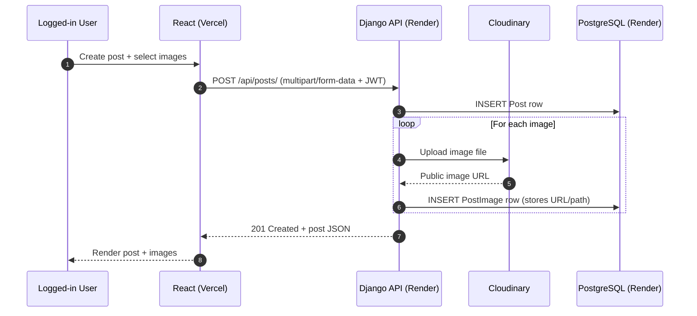

# 📝 Full Stack Blog Posting Platform

A full-stack blog application built with **React** and **Django REST Framework**, supporting **JWT authentication**, **multi-image uploads**, **guest demo mode**, and cloud deployment using **Render**, **Vercel**, and **Cloudinary**.

---

## 🚀 Live Links

- **Frontend (Vercel):** https://anupsblogspace.vercel.app  
- **Backend API (Render):** https://django-reactblog.onrender.com/api/

---

## ✨ Features

- 🔐 Signup / Login using JWT (access + refresh tokens)
- 📝 CRUD operations for blog posts (Create, Read, Update, Delete)
- 🖼️ Multi-image upload per post
- ☁️ Persistent media storage using Cloudinary
- 👤 Guest/Demo posting mode (no login required)
- 🔄 Axios token refresh using interceptors
- 🌍 Deployment: Django on Render + React on Vercel + PostgreSQL on Render

---

## 🧰 Tech Stack

**Frontend**
- React.js
- Axios
- React Router

**Backend**
- Django
- Django REST Framework
- SimpleJWT
- PostgreSQL
- Cloudinary (media storage)
- WhiteNoise (static files)

**Deployment**
- Render (backend + database)
- Vercel (frontend)

---

## 🗂️ Repository Structure (Monorepo)

```txt
Django_ReactBlog/
├── blog_backend/
│   ├── config/
│   ├── blog/
│   ├── manage.py
│   ├── requirements.txt
│   └── ...
├── blog_frontend/
│   ├── src/
│   ├── public/
│   ├── package.json
│   └── ...
└── README.md
```

---

## 🧠 High-Level Architecture

```mermaid
flowchart LR
  R[React Client<br/>(Vercel)] -->|Axios requests + JWT| D[Django REST API<br/>(Render)]
  D -->|ORM (SQL)| P[(PostgreSQL<br/>(Render))]
  D -->|Upload/Serve Media| C[Cloudinary<br/>(Media Storage)]
```

---

## 🔐 Authentication Flow (JWT)



---

## 👤 Demo (Guest) Posting Mode

Guest users can create demo posts **without login**.

### How it works
- Demo posts are stored in `sessionStorage` (browser tab only)
- Image preview uses `URL.createObjectURL(file)` which creates a temporary `blob:` URL
- Demo posts persist on refresh
- Demo posts disappear when the browser tab is closed



---

## 🧾 Real Posting Flow (Logged-in Users)



---

## 🗄️ Database Design (Simplified)

**Post**
- `id`
- `title`
- `content`
- `created_at`
- `author`

**PostImage**
- `id`
- `post_id` (FK → Post)
- `image` (Cloudinary URL)
- `uploaded_at`

---

## 🔌 Important API Endpoints

- `POST /api/auth/register/` → signup
- `POST /api/token/` → login (get access/refresh)
- `POST /api/token/refresh/` → refresh access token
- `GET /api/posts/` → list posts
- `POST /api/posts/` → create post (auth required)
- `GET /api/posts/<id>/` → post detail
- `PATCH /api/posts/<id>/` → edit (auth required)
- `DELETE /api/posts/<id>/` → delete (auth required)

---

## ⚙️ Environment Variables

### Backend (Render)
Set these in Render → your Django Web Service → **Environment**:

```env
DEBUG=0
SECRET_KEY=your-secret-key
DATABASE_URL=your-render-postgres-url
CLOUD_NAME=your-cloudinary-cloud-name
CLOUD_API_KEY=your-cloudinary-api-key
CLOUD_API_SECRET=your-cloudinary-api-secret
```

### Frontend (Vercel)
Set this in Vercel → Project → **Environment Variables**:

```env
REACT_APP_API_URL=https://django-reactblog.onrender.com/api/
```

> Note: `.env` is not committed. Use `.env.example` files for reference.

---

## 🛠️ Local Setup

### Backend
```bash
cd blog_backend
python -m venv venv
# Windows: venv\Scripts\activate
# Mac/Linux: source venv/bin/activate
pip install -r requirements.txt
python manage.py migrate
python manage.py runserver
```

### Frontend
```bash
cd blog_frontend
npm install
npm start
```

Frontend runs at: `http://localhost:3000`  
Backend runs at: `http://127.0.0.1:8000`

---

## 🚀 Deployment Notes

- Backend deployed on Render using Gunicorn
- PostgreSQL database hosted on Render
- Frontend deployed on Vercel
- Cloudinary is used for persistent media storage (prevents Render `/media/` 404 issues)

---

## 🧠 What I Learned

- Full-stack development flow (React ↔ Django REST ↔ DB)
- JWT auth implementation in SPA
- Handling file uploads in production using cloud media storage
- Debugging real deployment issues (CORS, ALLOWED_HOSTS, DB config)
- Production deployment with Render + Vercel

---

## 🔮 Future Improvements

- Post ownership permissions (only author can edit/delete)
- Pagination + search
- Comments and likes
- Google OAuth login
- Better UI (Tailwind/MUI)
- Automated tests

---

## 👨‍💻 Author

**Anup Dhakal**  
GitHub: https://github.com/Anup-Dhakal
